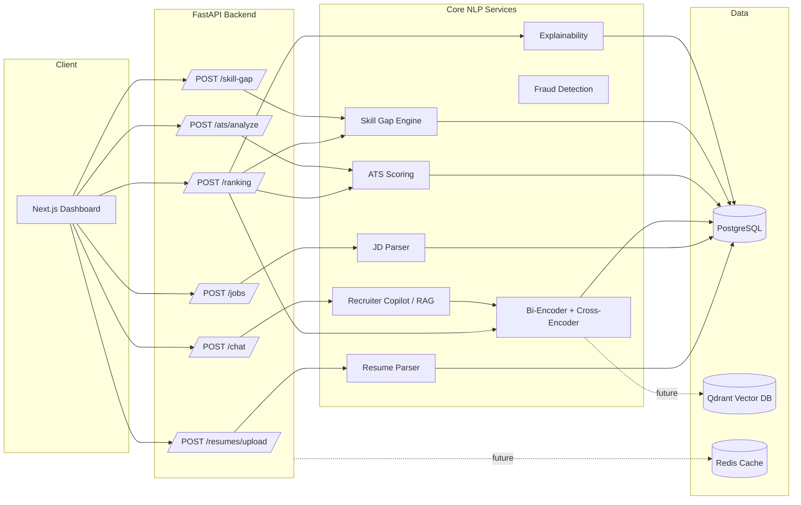

# Resume Screening AI

> Semantic resume parsing, ATS scoring, explainable candidate ranking, and a recruiter copilot — built as an open, auditable alternative to black-box ATS tools.

[](.github/workflows/ci.yml)
[](LICENSE)
[](backend/requirements.txt)
[](backend/requirements.txt)
[](frontend/package.json)
[](docker-compose.yml)
[](CONTRIBUTING.md)

---

## Project status — read this first

This repository ships a **working core platform**, not a mockup:

- ✅ **Fully implemented and tested**: resume parsing (PDF/DOCX/TXT), section/skill extraction, semantic matching (bi-encoder + cross-encoder), ATS scoring (keyword/formatting/readability), skill-gap analysis, rule-based fraud-risk detection, explainable ranking, a recruiter-copilot RAG chat endpoint, the FastAPI backend, the SQLAlchemy/Postgres data layer, a 7-page Next.js dashboard, Docker Compose orchestration, and a backend unit-test suite (`pytest`, 17 passing tests covering parsing, ATS scoring, skill-gap, and fraud heuristics).
- 🧩 **Scaffolded, with a clear extension point**: multi-agent orchestration (the seven "agents" in the brief map onto the services in `backend/app/services/` — wiring them into autonomous LangChain agents is a documented next step in [ROADMAP.md](ROADMAP.md)), Qdrant vector search for cross-candidate similarity (the client and collection config are in place; the ingestion job is a stub), multi-cloud Terraform, and the full MLOps training loop (`training/` has real preprocessing/feature code; model artifacts are not pre-trained and shipped, since that requires a labeled dataset you provide).
- 📦 **Not included**: pre-trained proprietary models, copyrighted datasets, screenshots/video (placeholders + sourcing instructions are provided in `demo/` and `datasets/README.md` instead, since binary assets can't be authored sight-unseen).

If you want the single most useful thing to run first: `docker compose up`, then open `http://localhost:3000`, upload a resume, paste a job description, and hit **Rank**.

---

## Features

### Resume Parsing Engine
Extracts education, experience, skills, certifications, projects, and publications from PDF/DOCX/TXT using `pdfplumber` + `python-docx` + spaCy NER, with a regex-based section splitter (see `backend/app/services/parser.py`).

### Semantic Matching Engine
Two-stage retrieval: a `sentence-transformers` bi-encoder for fast first-pass cosine similarity, then a cross-encoder for accurate (resume, job) pairwise reranking (`backend/app/services/embeddings.py`).

### ATS Optimization Module
Keyword overlap, structural formatting heuristics, and a Flesch-Reading-Ease-based readability score, combined into one ATS score (`backend/app/services/ats_scoring.py`).

### Skill Gap Analyzer
Diffs candidate skills against job-required/preferred skills and suggests learning resources for the gaps (`backend/app/services/skill_gap.py`).

### Explainable AI
Every ranking ships with a transparent linear contribution breakdown — not a black box. Sub-scores × weights sum exactly to the final score, so a recruiter can see precisely why one candidate outranked another (`backend/app/services/explainability.py`).

### Resume Fraud Detection
Auditable, non-black-box heuristics: timeline inconsistencies, keyword-stuffing density, template/AI-boilerplate density, and (when wired to Qdrant) near-duplicate content detection (`backend/app/services/fraud_detection.py`).

### Recruiter Copilot (RAG)
Chat with a resume or job description. Retrieval is local embedding similarity; generation is pluggable (OpenAI / Ollama / a fully offline extractive fallback so it works with zero API keys) (`backend/app/services/recruiter_copilot.py`).

---

## Architecture



See [docs/ARCHITECTURE.md](docs/ARCHITECTURE.md) for the data-flow, ER, and deployment diagrams.

---

## Tech stack

| Layer | Technology |
|---|---|
| Backend | Python, FastAPI, SQLAlchemy |
| Frontend | Next.js 14 (App Router), TypeScript, Tailwind CSS |
| NLP / ML | sentence-transformers, spaCy, scikit-learn, (optional) LangChain + OpenAI/Ollama |
| Database | PostgreSQL |
| Vector DB | Qdrant *(client wired, ingestion job is a documented stub — see Roadmap)* |
| Cache | Redis *(provisioned in Docker Compose; not yet on the hot path)* |
| Containerization | Docker, Docker Compose |
| CI/CD | GitHub Actions (lint, test, Trivy scan, frontend build) |

---

## Quickstart

### Option A — Docker Compose (recommended)

```bash
git clone <this-repo-url>
cd Resume-Screening-AI-NLP-Project
cp backend/.env.example backend/.env       # edit secrets if needed
docker compose up --build
```

- Backend: http://localhost:8000/docs (interactive OpenAPI/Swagger)
- Frontend: http://localhost:3000

### Option B — Run locally without Docker

```bash
# Backend
cd backend
python -m venv .venv && source .venv/bin/activate
pip install -r requirements.txt
python -m spacy download en_core_web_sm
cp .env.example .env   # point DATABASE_URL at a local Postgres, or use SQLite for a quick demo:
#   DATABASE_URL=sqlite:///./dev.db
uvicorn app.main:app --reload

# Frontend (separate terminal)
cd frontend
cp .env.local.example .env.local
npm install
npm run dev
```

### Run the test suite

```bash
cd backend
pip install -r requirements.txt pytest pytest-cov
pytest --cov=app
```

---

## API overview

Full interactive docs are auto-generated at `/docs` (Swagger) and `/redoc`. Summary:

| Method | Path | Purpose |
|---|---|---|
| `POST` | `/api/v1/resumes/upload` | Upload + parse a resume |
| `GET`  | `/api/v1/resumes/` | List parsed candidates |
| `POST` | `/api/v1/jobs/` | Create a job description (auto-extracts required/preferred skills) |
| `POST` | `/api/v1/ranking/` | Rank candidates against a job, with full explainability |
| `POST` | `/api/v1/ats/analyze` | ATS sub-scores for one candidate × one job |
| `POST` | `/api/v1/skill-gap` | Missing skills + learning recommendations |
| `POST` | `/api/v1/chat/` | Ask the recruiter copilot a grounded question |

---

## Repository structure

```
Resume-Screening-AI-NLP-Project/
├── backend/                 # FastAPI app, services, models, tests
│   └── app/
│       ├── api/v1/routes/   # HTTP endpoints
│       ├── services/        # parsing, embeddings, ATS, fraud, ranking, copilot
│       ├── models/          # SQLAlchemy ORM + Pydantic schemas
│       └── core/            # settings
├── frontend/                # Next.js dashboard (7 pages)
├── training/                # Offline preprocessing / feature engineering / model training scaffolds
├── datasets/                # Dataset sourcing guide (no copyrighted data committed)
├── demo/                    # Sample synthetic resumes & job descriptions
├── docs/                    # Architecture, diagrams, deployment guides
└── .github/                 # CI workflow, issue/PR templates
```

---

## Deployment

- **Docker**: `docker-compose.yml` at repo root — production images for backend and frontend.
- **Render / Railway**: both platforms can deploy directly from the `backend/Dockerfile` and `frontend/Dockerfile`; point their Postgres/Redis add-ons at the `DATABASE_URL`/`REDIS_URL` env vars.
- **AWS / Azure / GCP**: the containers are cloud-agnostic. See [docs/ARCHITECTURE.md](docs/ARCHITECTURE.md#deployment) for a reference ECS/Container Apps/Cloud Run layout. Terraform modules are not included — tracked in [ROADMAP.md](ROADMAP.md).

---

## Roadmap

See [ROADMAP.md](ROADMAP.md) for the prioritized list — headline items are Qdrant-backed cross-candidate search, LangChain multi-agent orchestration, and a trained (not just heuristic) ranking model with SHAP explanations over real labeled data.

## Contributing

See [CONTRIBUTING.md](CONTRIBUTING.md). All contributors are expected to follow the [Code of Conduct](CODE_OF_CONDUCT.md).

## Security

See [SECURITY.md](SECURITY.md) for how to report a vulnerability.

## License

MIT — see [LICENSE](LICENSE).
